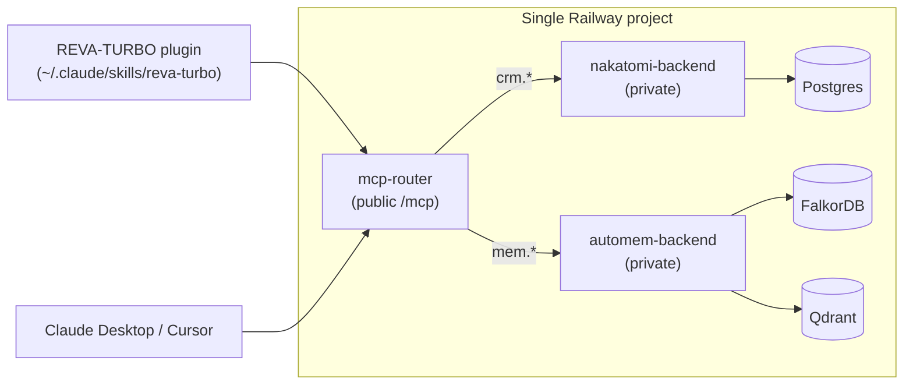

# REVA-OPS

**The AI operations stack for Rev A Manufacturing.**

One monorepo. One Railway deploy. One MCP endpoint. Three systems working together:

- **REVA-TURBO plugin** — 46 skills that run inside Claude Code for every PM workflow at Rev A (RFQ → quote → China sourcing → compliance → quality → shipping).
- **Nakatomi CRM** (internal) — headless AI-native CRM, Postgres-backed, customized for Rev A's pipeline and custom fields.
- **AutoMem** (internal) — hybrid graph + vector memory (FalkorDB + Qdrant) for durable team-wide knowledge.

A thin **MCP router** is the only publicly exposed service. It speaks the Model Context Protocol to agents and proxies internally to the CRM + memory backends. One URL, one bearer token, one connector config — that's what the plugin and Claude Desktop / Cursor need to know.



## Repository layout

```
RevOps-RevAMfg/
├── plugin/             ← REVA-TURBO Claude Code plugin (46 skills, 20 commands)
│   ├── skills/
│   ├── bin/
│   ├── install.sh      ← one-liner plugin installer
│   └── .claude-plugin/
├── services/
│   ├── mcp-router/     ← single unified MCP endpoint (FastAPI + FastMCP)
│   ├── nakatomi-backend/  ← Nakatomi CRM (vendored-by-reference, Rev A seed overlay)
│   └── automem-backend/   ← AutoMem memory (vendored-by-reference)
├── railway/
│   ├── template.yaml   ← one-click Railway template (1 project, 3 services + 3 plugins)
│   ├── deploy.sh       ← CLI deploy for MrDula Solutions admins
│   └── README.md
└── docs/
    ├── ARCHITECTURE.md
    ├── INSTALL.md
    └── ROADMAP.md
```

## For end users (Rev A PMs)

Your admin deploys the backend once and shares the router URL + a one-time signup token. Then you run:

```bash
curl -fsSL https://raw.githubusercontent.com/mrdulasolutions/RevOps-RevAMfg/main/plugin/install.sh \
  | REVA_MCP_URL=https://<router>.up.railway.app/mcp bash
```

The installer drops into a short wizard that prompts for your name, email, a password (12+ chars — you'll only need it to reset your key), and the signup token. Under the hood it calls the router's `/signup` endpoint, which mints a personal `nk_...` API key scoped to your user and writes it into `~/.claude/mcp.json`.

Prefer the browser? Visit `https://<router>.up.railway.app/signup` instead and you'll get the same key + an exact install command to paste.

Restart Claude Code, then `/reva-turbo:revmyengine`. The engine is now connected to the shared CRM and memory — everything you log is available to the whole team, and every action is attributed to your user on the Nakatomi timeline.

See [`docs/AUTH.md`](./docs/AUTH.md) for the full auth flow and rotation story.

## For admins (MrDula Solutions)

Deploy the backend for a new customer:

```bash
git clone https://github.com/mrdulasolutions/RevOps-RevAMfg.git
cd RevOps-RevAMfg
./railway/deploy.sh --project-name reva-ops --admin-email you@reva.com
# → prints public MCP URL + admin API key
```

One Railway project. Three application services (`mcp-router`, `nakatomi-backend`, `automem-backend`). Three managed databases (Postgres, FalkorDB, Qdrant). Wired up automatically via Railway's private network — only `mcp-router` has a public domain.

See [`railway/README.md`](./railway/README.md) for the full deploy story.

## Why one MCP endpoint

Two reasons we run a router instead of exposing Nakatomi's `/mcp` and AutoMem's `/mcp` separately:

1. **One connector config, not two.** Every MCP client (Claude Desktop, Cursor, the plugin) has to be pointed at every endpoint by hand. Doubling the connector count doubles the onboarding friction for a PM team.
2. **Cross-system tools.** "Remember this ITAR ruling and tag it to Acme's contact" is a memory write *and* a CRM link. A router owns that orchestration (`reva_remember_about_entity`); two isolated MCPs cannot.

Tool namespaces keep the surface tidy:

| Prefix | Backend  | Examples                                                 |
|--------|----------|----------------------------------------------------------|
| `crm_` | Nakatomi | `crm_search_contacts`, `crm_create_deal`, `crm_move_deal_stage` |
| `mem_` | AutoMem  | `mem_store`, `mem_recall`, `mem_associate`               |
| `reva_`| router   | `reva_remember_about_entity`, `reva_recall_for_entity`   |

## Rev A customizations

Delivered as overlays, not forks:

- **Pipeline** — `Manufacturing RFQ` with 12 stages (RFQ Received → Qualified → Quoted → Accepted → In Manufacturing → Inspection (G2) → Repackage → Shipped → Delivered → Invoiced → Paid → Closed Lost)
- **Custom fields** — `company.compliance`, `company.partner_scorecard`, `deal.quality_gates`, `deal.ncrs`, `deal.part_numbers`, `contact.role`
- **Memory taxonomy** — `reva/rfq`, `reva/quality`, `reva/compliance`, `reva/china-source`, `reva/partner-scorecard`, …

All defined in [`services/nakatomi-backend/seed/reva.py`](./services/nakatomi-backend/seed/reva.py) and applied automatically by `railway/deploy.sh`.

## Documentation

- [`docs/ARCHITECTURE.md`](./docs/ARCHITECTURE.md) — component layout, data flow, hook system
- [`docs/INSTALL.md`](./docs/INSTALL.md) — plugin install reference (env overrides, offline, troubleshooting)
- [`docs/ROADMAP.md`](./docs/ROADMAP.md) — what's shipped, what's next
- [`plugin/CLIENT.md`](./plugin/CLIENT.md) — Rev A Manufacturing company profile
- [`plugin/ETHOS.md`](./plugin/ETHOS.md) — design philosophy
- [`plugin/CLAUDE.md`](./plugin/CLAUDE.md) — Claude Code project instructions
- [`services/mcp-router/README.md`](./services/mcp-router/README.md) — router internals
- [`railway/README.md`](./railway/README.md) — Railway deploy reference

---

Built by [MrDula Solutions](https://mrdulasolutions.com) for Rev A Manufacturing. Powered by Claude Code, [Nakatomi](https://github.com/mrdulasolutions/NakatomiCRM), and [AutoMem](https://github.com/mrdulasolutions/automem).
