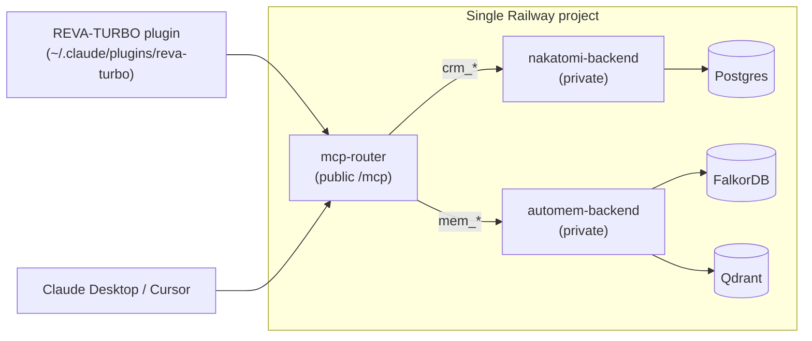

# REVA-OPS

**The AI operations stack for Rev A Manufacturing.**

One monorepo. One Railway deploy. One MCP endpoint. Three systems working
together:

- **REVA-TURBO plugin** — 48 skills that run inside Claude Code / Claude
  Desktop for every PM workflow at Rev A (RFQ → quote → China sourcing →
  compliance → quality → shipping).
- **Nakatomi CRM** (internal) — headless AI-native CRM, Postgres-backed,
  customized for Rev A's pipeline and custom fields.
- **AutoMem** (internal) — hybrid graph + vector memory (FalkorDB + Qdrant)
  for durable team-wide knowledge.

A thin **MCP router** is the only publicly exposed service. It speaks the
Model Context Protocol to agents and proxies internally to the CRM and
memory backends. One URL, one bearer token, one connector config — that's
what the plugin and Claude Desktop / Cursor need to know.



## Repository layout

```
RevOps-RevAMfg/
├── plugin/                      ← REVA-TURBO Claude plugin (48 skills)
│   ├── skills/                  ← one directory per skill (SKILL.md + assets)
│   ├── bin/                     ← telemetry, session-track, config helpers
│   ├── setup                    ← post-install bootstrap
│   ├── install.sh               ← curl-able CLI installer (legacy path)
│   ├── build-bundle.sh          ← builds dist/reva-turbo-<ver>.zip
│   ├── .claude-plugin/
│   │   └── plugin.json          ← manifest + userConfig prompts + mcpServers
│   └── dist/                    ← built zips (gitignored; shipped via Releases)
├── services/
│   ├── mcp-router/              ← unified MCP endpoint (FastAPI + FastMCP)
│   ├── nakatomi-backend/
│   │   └── seed/reva.py         ← Rev A pipeline + custom-field overlay
│   └── automem-backend/         ← AutoMem is vendored-by-reference via Railway
├── railway/
│   ├── deploy.sh                ← phased deploy (init/services/seed/finalize)
│   ├── template.yaml            ← reference stack spec (not executable)
│   └── README.md                ← deploy reference
└── docs/
    ├── ARCHITECTURE.md, ARCHITECTURE_V2.md, AUTH.md, INSTALL.md, ROADMAP.md
```

## For end users (Rev A PMs)

Your admin deploys the backend once and shares two things with you: the
**router URL** (e.g. `https://mcp-router-production-460a.up.railway.app/mcp`)
and a one-time **signup token**. From there it's three steps — no terminal
needed.

**1. Get your personal API key.** Visit `<router-url-without-/mcp>/signup`
in your browser. Enter your name, work email, a password (12+ chars — only
used for future key resets), and the signup token. The page shows your
`nk_...` key once. Copy it.

**2. Download the plugin bundle.** Grab the latest `reva-turbo-<version>.zip`
from the project's [GitHub Releases](https://github.com/mrdulasolutions/RevOps-RevAMfg/releases)
page. (The zip contains a single top-level `reva-turbo/` directory — don't
unzip it before upload.)

**3. Upload it into Claude Desktop.** Open **Plugins → Personal → Local
uploads → `+`** and drop in the zip. On enable, Claude prompts for two
values:

- **`mcp_url`** — the router URL your admin shared (the full `/mcp` form)
- **`api_key`** — the `nk_...` key from step 1 (stored in your OS keychain,
  not a plaintext file)

That's it. Run `/reva-turbo:revmyengine` and the engine is connected to the
shared CRM and memory. Everything you log is available to the whole team,
and every action is attributed to your user on the Nakatomi timeline.

> Prefer the terminal? The legacy CLI path still works for Claude Code
> users:
> ```bash
> curl -fsSL https://raw.githubusercontent.com/mrdulasolutions/RevOps-RevAMfg/main/plugin/install.sh \
>   | REVA_MCP_URL=https://<router>.up.railway.app/mcp bash
> ```
> It drops into the same signup wizard and writes `~/.claude/mcp.json`
> directly.

See [`docs/AUTH.md`](./docs/AUTH.md) for the full auth flow and rotation
story.

## For admins (MrDula Solutions)

Deploy the backend for a new customer:

```bash
git clone https://github.com/mrdulasolutions/RevOps-RevAMfg.git
cd RevOps-RevAMfg
./railway/deploy.sh --project-name reva-ops --admin-email you@reva.com
# → prints public MCP URL + admin API key + signup token
```

One Railway project. Three application services (`mcp-router`,
`nakatomi-backend`, `automem-backend`). Three managed databases (Postgres,
FalkorDB, Qdrant). Wired up automatically via Railway's private network —
only `mcp-router` has a public domain.

The deploy is phased (`init` / `services` / `seed` / `finalize`), so any
individual phase can be re-run if something fails mid-flight. See
[`railway/README.md`](./railway/README.md) for the full story, including
the one-time Railway GitHub App install flow.

## Why one MCP endpoint

Two reasons we run a router instead of exposing Nakatomi's `/mcp` and
AutoMem's `/mcp` separately:

1. **One connector config, not two.** Every MCP client (Claude Desktop,
   Cursor, the plugin) has to be pointed at every endpoint by hand.
   Doubling the connector count doubles the onboarding friction for a PM
   team.
2. **Cross-system tools.** "Remember this ITAR ruling and tag it to Acme's
   contact" is a memory write *and* a CRM link. A router owns that
   orchestration (`reva_remember_about_entity`); two isolated MCPs cannot.

Tool namespaces keep the surface tidy:

| Prefix  | Backend  | Examples                                                         |
|---------|----------|------------------------------------------------------------------|
| `crm_`  | Nakatomi | `crm_search_contacts`, `crm_create_deal`, `crm_move_deal_stage`  |
| `mem_`  | AutoMem  | `mem_store`, `mem_recall`, `mem_associate`                       |
| `reva_` | router   | `reva_remember_about_entity`, `reva_recall_for_entity`           |

## Rev A customizations

Delivered as overlays, not forks. Applied automatically by `railway/deploy.sh`
phase 3 (`seed`):

- **Pipeline — `Manufacturing RFQ`** (12 stages): RFQ Received → Qualified
  → Quoted → Accepted → In Manufacturing → Inspection (G2) → Repackage →
  Shipped → Delivered → Invoiced → Paid (won) → Closed Lost.
- **Custom fields** (8 total): `company.partner_scorecard`,
  `company.compliance`, `company.region`, `contact.role`,
  `deal.quality_gates`, `deal.ncrs`, `deal.part_numbers`,
  `deal.china_source`. JSON-shaped payloads ride as `text` because
  Nakatomi's custom-field schema is scalar-only.
- **Memory taxonomy** — `reva/rfq`, `reva/quality`, `reva/compliance`,
  `reva/china-source`, `reva/partner-scorecard`, `reva/ncr`,
  `reva/shipping`, `reva/itar`.

All defined in [`services/nakatomi-backend/seed/reva.py`](./services/nakatomi-backend/seed/reva.py).

## Documentation

- [`docs/ARCHITECTURE.md`](./docs/ARCHITECTURE.md) / [`docs/ARCHITECTURE_V2.md`](./docs/ARCHITECTURE_V2.md) — component layout, data flow, hook system
- [`docs/AUTH.md`](./docs/AUTH.md) — signup / rotation story
- [`docs/INSTALL.md`](./docs/INSTALL.md) — plugin install reference (env overrides, offline, troubleshooting)
- [`docs/ROADMAP.md`](./docs/ROADMAP.md) — what's shipped, what's next
- [`plugin/CLIENT.md`](./plugin/CLIENT.md) — Rev A Manufacturing company profile
- [`plugin/ETHOS.md`](./plugin/ETHOS.md) — design philosophy
- [`plugin/CLAUDE.md`](./plugin/CLAUDE.md) — Claude Code project instructions
- [`services/mcp-router/README.md`](./services/mcp-router/README.md) — router internals
- [`railway/README.md`](./railway/README.md) — Railway deploy reference

---

Built by [MrDula Solutions](https://mrdulasolutions.com) for Rev A
Manufacturing. Powered by Claude, [Nakatomi](https://github.com/mrdulasolutions/NakatomiCRM),
and [AutoMem](https://github.com/mrdulasolutions/automem).
